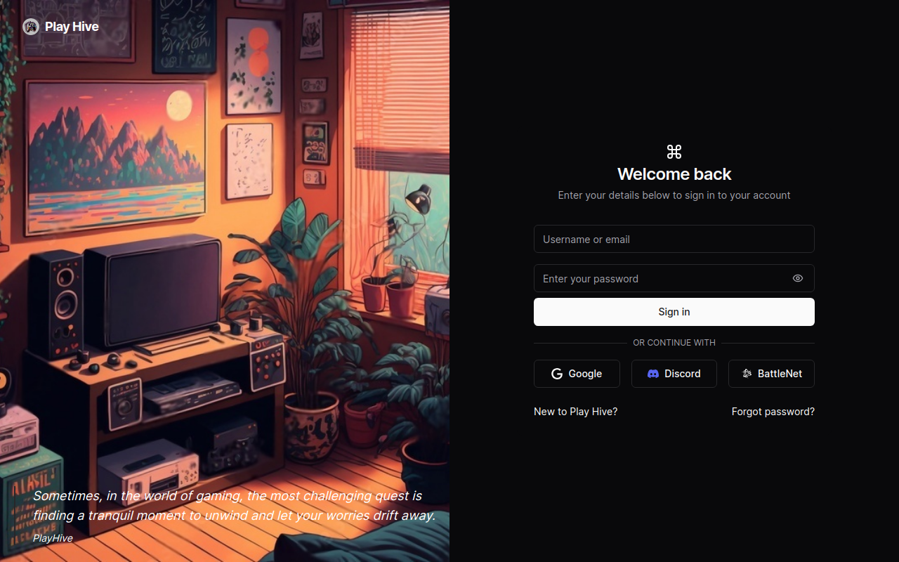

<p align="center">
<a href=https://github.com/AdamCKW/play-hive target="_blank">

</a>
</p>


<p align="center">


</p>

<p></p>
<p></p>

# 📌 Overview

Play-Hive is a project that utilizes various libraries and tools such as Next.js, Prisma, React, TailwindCSS, and many more. It leverages these dependencies to create a feature-rich and interactive web application.

## 🔍 Table of Contents

- [📌 Overview](#-overview)
  - [🔍 Table of Contents](#-table-of-contents)
  - [📁 Project Structure](#-project-structure)
  - [📝 Project Summary](#-project-summary)
  - [💻 Stack](#-stack)
  - [⚙️ Setting Up](#️-setting-up)
      - [Your Environment Variable](#your-environment-variable)
- [Environment Variables](#environment-variables)
  - [🚀 Run Locally](#-run-locally)
  - [🙌 Contributors](#-contributors)
  - [☁️ Deploy](#️-deploy)
  - [📄 License](#-license)

## 📁 Project Structure

```bash
├── .editorconfig
├── .eslintignore
├── .eslintrc.json
├── .gitignore
├── .prettierignore
├── .prettierrc.json
├── LICENSE
├── README.md
├── app
│   ├── [locale]
│   │   ├── (auth)
│   │   │   ├── forgot-password
│   │   │   │   ├── [token]
│   │   │   │   │   └── page.tsx
│   │   │   │   └── page.tsx
│   │   │   ├── layout.tsx
│   │   │   ├── sign-in
│   │   │   │   └── page.tsx
│   │   │   └── sign-up
│   │   │       └── page.tsx
│   │   ├── (communication)
│   │   │   ├── c
│   │   │   │   ├── (feed)
│   │   │   │   │   ├── layout.tsx
│   │   │   │   │   └── page.tsx
│   │   │   │   ├── [name]
│   │   │   │   │   ├── create
│   │   │   │   │   │   ├── layout.tsx
│   │   │   │   │   │   └── page.tsx
│   │   │   │   │   ├── layout.tsx
│   │   │   │   │   └── page.tsx
│   │   │   │   └── layout.tsx
│   │   │   ├── following
│   │   │   │   ├── layout.tsx
│   │   │   │   └── page.tsx
│   │   │   └── messages
│   │   │       ├── [username]
│   │   │       │   ├── layout.tsx
│   │   │       │   └── page.tsx
│   │   │       ├── layout.tsx
│   │   │       └── page.tsx
│   │   ├── (policy)
│   │   │   ├── cookies
│   │   │   │   └── page.tsx
│   │   │   ├── privacy
│   │   │   │   └── page.tsx
│   │   │   ├── terms
│   │   │   │   └── page.tsx
│   │   │   └── layout.tsx
│   │   ├── (root)
│   │   │   ├── [username]
│   │   │   │   ├── (profile)
│   │   │   │   │   ├── layout.tsx
│   │   │   │   │   ├── page.tsx
│   │   │   │   │   └── replies
│   │   │   │   │       └── page.tsx
│   │   │   │   └── settings
│   │   │   │       └── page.tsx
│   │   │   ├── d
│   │   │   │   ├── manage
│   │   │   │   │   ├── columns.tsx
│   │   │   │   │   └── page.tsx
│   │   │   │   └── reports
│   │   │   │       ├── columns.tsx
│   │   │   │       └── page.tsx
│   │   │   ├── discover
│   │   │   │   └── page.tsx
│   │   │   ├── layout.tsx
│   │   │   ├── news
│   │   │   │   └── page.tsx
│   │   │   ├── p
│   │   │   │   └── [id]
│   │   │   │       └── page.tsx
│   │   │   └── page.tsx
│   │   ├── layout.tsx
│   │   ├── not-found.tsx
│   │   └── verify
│   │       └── page.tsx
│   ├── api
│   │   ├── auth
│   │   │   ├── [...nextauth]
│   │   │   │   └── route.ts
│   │   │   ├── forgot-password
│   │   │   │   ├── [id]
│   │   │   │   │   └── route.ts
│   │   │   │   └── route.ts
│   │   │   └── register
│   │   │       └── route.ts
│   │   ├── community
│   │   │   ├── [id]
│   │   │   │   ├── route.ts
│   │   │   │   ├── subscribe
│   │   │   │   │   └── route.ts
│   │   │   │   └── unsubscribe
│   │   │   │       └── route.ts
│   │   │   └── route.ts
│   │   ├── d
│   │   │   ├── manage
│   │   │   │   └── route.ts
│   │   │   └── reports
│   │   │       └── route.ts
│   │   ├── gamespot
│   │   │   └── route.ts
│   │   ├── messages
│   │   │   ├── [id]
│   │   │   │   └── route.ts
│   │   │   └── route.ts
│   │   ├── posts
│   │   │   ├── [id]
│   │   │   │   ├── comments
│   │   │   │   │   └── route.ts
│   │   │   │   ├── like
│   │   │   │   │   └── route.ts
│   │   │   │   ├── report
│   │   │   │   │   └── route.ts
│   │   │   │   ├── route.ts
│   │   │   │   └── unlike
│   │   │   │       └── route.ts
│   │   │   ├── discover
│   │   │   │   └── route.ts
│   │   │   └── route.ts
│   │   ├── search
│   │   │   └── route.ts
│   │   ├── uploadthing
│   │   │   ├── core.ts
│   │   │   └── route.ts
│   │   └── users
│   │       └── [id]
│   │           ├── follow
│   │           │   └── route.ts
│   │           ├── posts
│   │           │   └── route.ts
│   │           ├── replies
│   │           │   └── route.ts
│   │           ├── route.ts
│   │           └── unfollow
│   │               └── route.ts
│   └── globals.css
├── assets
│   └── fonts
│       ├── CalSans-SemiBold.ttf
│       ├── CalSans-SemiBold.woff
│       ├── CalSans-SemiBold.woff2
│       ├── Inter-Bold.ttf
│       └── Inter-Regular.ttf
├── components.json
├── components
│   ├── action-tooltip.tsx
│   ├── auth
│   │   ├── forgot-password-form.tsx
│   │   ├── new-password-form.tsx
│   │   ├── oauth-signin.tsx
│   │   ├── sign-in-button.tsx
│   │   ├── user-login-form.tsx
│   │   └── user-register-form.tsx
│   ├── community
│   │   ├── community-modal.tsx
│   │   ├── create-button.tsx
│   │   ├── create-community.tsx
│   │   ├── create
│   │   │   ├── post-editor.tsx
│   │   │   └── submit-plate.tsx
│   │   ├── edit-community-button.tsx
│   │   ├── edit-community-modal.tsx
│   │   ├── feeds
│   │   │   ├── community-feed.tsx
│   │   │   └── main-feed.tsx
│   │   ├── join-community-toggle.tsx
│   │   ├── join-community.tsx
│   │   └── joined-communities.tsx
│   ├── data-table
│   │   ├── filter.tsx
│   │   ├── headers.tsx
│   │   ├── manage-actions.tsx
│   │   ├── manage-data-table.tsx
│   │   ├── pagination.tsx
│   │   ├── report-actions.tsx
│   │   ├── reports-data-table.tsx
│   │   ├── toolbar.tsx
│   │   └── view-options.tsx
│   ├── file-upload.tsx
│   ├── icons.tsx
│   ├── layout
│   │   ├── bottom-bar.tsx
│   │   ├── left-bar.tsx
│   │   ├── left-items.tsx
│   │   ├── locale-switch.tsx
│   │   ├── nav-bar-items.tsx
│   │   ├── nav-bar.tsx
│   │   ├── right-bar.tsx
│   │   ├── search.tsx
│   │   ├── theme-toggle.tsx
│   │   └── user-account-nav.tsx
│   ├── loading.tsx
│   ├── messages
│   │   ├── chat-body.tsx
│   │   ├── chat-header.tsx
│   │   ├── chat-input.tsx
│   │   ├── chat-item.tsx
│   │   ├── emoji-picker.tsx
│   │   ├── empty-state.tsx
│   │   ├── message-file-modal.tsx
│   │   ├── messages-list-bar.tsx
│   │   ├── messages-list.tsx
│   │   ├── user-list-bar.tsx
│   │   └── users-list.tsx
│   ├── models
│   │   └── image-modal.tsx
│   ├── news
│   │   ├── news-card.tsx
│   │   ├── news-feed.tsx
│   │   └── news-skeleton-card.tsx
│   ├── plate-ui
│   │   ├── align-dropdown-menu.tsx
│   │   ├── avatar.tsx
│   │   ├── blockquote-element.tsx
│   │   ├── button.tsx
│   │   ├── caption.tsx
│   │   ├── checkbox.tsx
│   │   ├── code-block-combobox.tsx
│   │   ├── code-block-element.css
│   │   ├── code-block-element.tsx
│   │   ├── code-leaf.tsx
│   │   ├── code-line-element.tsx
│   │   ├── code-syntax-leaf.tsx
│   │   ├── color-constants.ts
│   │   ├── color-dropdown-menu-items.tsx
│   │   ├── color-dropdown-menu.tsx
│   │   ├── color-input.tsx
│   │   ├── color-picker.tsx
│   │   ├── colors-custom.tsx
│   │   ├── combobox.tsx
│   │   ├── command.tsx
│   │   ├── cursor-overlay.tsx
│   │   ├── dialog.tsx
│   │   ├── draggable.tsx
│   │   ├── dropdown-menu.tsx
│   │   ├── editor.tsx
│   │   ├── embed-toolbar-button.tsx
│   │   ├── emoji-combobox.tsx
│   │   ├── emoji-dropdown-menu.tsx
│   │   ├── emoji-icons.tsx
│   │   ├── emoji-picker-content.tsx
│   │   ├── emoji-picker-navigation.tsx
│   │   ├── emoji-picker-preview.tsx
│   │   ├── emoji-picker-search-and-clear.tsx
│   │   ├── emoji-picker-search-bar.tsx
│   │   ├── emoji-picker.tsx
│   │   ├── emoji-toolbar-dropdown.tsx
│   │   ├── fixed-toolbar-buttons.tsx
│   │   ├── fixed-toolbar.tsx
│   │   ├── floating-toolbar-buttons.tsx
│   │   ├── floating-toolbar.tsx
│   │   ├── heading-element.tsx
│   │   ├── highlight-leaf.tsx
│   │   ├── hr-element.tsx
│   │   ├── image-element.tsx
│   │   ├── indent-list-toolbar-button.tsx
│   │   ├── indent-toolbar-button.tsx
│   │   ├── input.tsx
│   │   ├── insert-dropdown-menu.tsx
│   │   ├── kbd-leaf.tsx
│   │   ├── line-height-dropdown-menu.tsx
│   │   ├── link-element.tsx
│   │   ├── link-floating-toolbar.tsx
│   │   ├── link-toolbar-button.tsx
│   │   ├── list-element.tsx
│   │   ├── list-toolbar-button.tsx
│   │   ├── mark-toolbar-button.tsx
│   │   ├── media-embed-element.tsx
│   │   ├── media-popover.tsx
│   │   ├── media-toolbar-button.tsx
│   │   ├── mode-dropdown-menu.tsx
│   │   ├── more-dropdown-menu.tsx
│   │   ├── outdent-toolbar-button.tsx
│   │   ├── paragraph-element.tsx
│   │   ├── placeholder.tsx
│   │   ├── popover.tsx
│   │   ├── resizable.tsx
│   │   ├── search-highlight-leaf.tsx
│   │   ├── separator.tsx
│   │   ├── tabbable-element.tsx
│   │   ├── table-cell-element.tsx
│   │   ├── table-dropdown-menu.tsx
│   │   ├── table-element.tsx
│   │   ├── table-row-element.tsx
│   │   ├── todo-list-element.tsx
│   │   ├── toggle.tsx
│   │   ├── toolbar.tsx
│   │   ├── tooltip.tsx
│   │   ├── turn-into-dropdown-menu.tsx
│   │   └── with-draggables.tsx
│   ├── posts
│   │   ├── comment
│   │   │   ├── comment-modal.tsx
│   │   │   └── create-comment.tsx
│   │   ├── controls
│   │   │   ├── index.tsx
│   │   │   ├── like.tsx
│   │   │   └── share.tsx
│   │   ├── create
│   │   │   ├── button-client.tsx
│   │   │   ├── create-post.tsx
│   │   │   └── post-modal.tsx
│   │   ├── deleted-card.tsx
│   │   ├── feeds
│   │   │   ├── children.tsx
│   │   │   ├── discover-feed.tsx
│   │   │   ├── main-feed.tsx
│   │   │   ├── main.tsx
│   │   │   ├── parent.tsx
│   │   │   ├── profile-feed.tsx
│   │   │   └── replies-feed.tsx
│   │   ├── image.tsx
│   │   ├── main-card.tsx
│   │   ├── more-menu.tsx
│   │   ├── name-link.tsx
│   │   ├── others.tsx
│   │   ├── post-card.tsx
│   │   ├── skeleton-card.tsx
│   │   ├── timestamp.tsx
│   │   └── viewer.tsx
│   ├── profile
│   │   ├── edit-full.tsx
│   │   ├── edit-limited.tsx
│   │   ├── follow.tsx
│   │   ├── loading.tsx
│   │   └── self-share.tsx
│   ├── theme-provider.tsx
│   ├── timer-redirect.tsx
│   ├── ui
│   │   ├── aspect-ratio.tsx
│   │   ├── avatar.tsx
│   │   ├── badge.tsx
│   │   ├── button.tsx
│   │   ├── card.tsx
│   │   ├── checkbox.tsx
│   │   ├── command.tsx
│   │   ├── dialog.tsx
│   │   ├── dropdown-menu.tsx
│   │   ├── form.tsx
│   │   ├── hover-card.tsx
│   │   ├── input.tsx
│   │   ├── label.tsx
│   │   ├── popover.tsx
│   │   ├── scroll-area.tsx
│   │   ├── select.tsx
│   │   ├── separator.tsx
│   │   ├── skeleton.tsx
│   │   ├── table.tsx
│   │   ├── textarea.tsx
│   │   ├── toast.tsx
│   │   ├── toaster.tsx
│   │   └── tooltip.tsx
│   ├── user-avatar.tsx
│   └── widgets
│       ├── communities-suggestions-card.tsx
│       └── user-suggestions-card.tsx
├── config
│   ├── display-config.ts
│   ├── lang
│   │   ├── en.json
│   │   ├── ja.json
│   │   ├── ms.json
│   │   └── zh.json
│   ├── navigation.ts
│   └── site.ts
├── emails
│   ├── reset.tsx
│   └── verify.tsx
├── hooks
│   ├── initiate-socket.ts
│   ├── use-chat-pusher.ts
│   ├── use-chat-query.ts
│   ├── use-chat-scroll.ts
│   ├── use-infinite-post-query.ts
│   ├── use-intl.ts
│   ├── use-modal-store.ts
│   ├── use-post-query.ts
│   ├── use-toast.ts
│   ├── use-update-infinite-post-query.ts
│   └── use-update-post-query.ts
├── i18n.ts
├── lib
│   ├── auth.ts
│   ├── db.ts
│   ├── messages
│   │   └── conversation.ts
│   ├── plate
│   │   ├── autoformatBlocks.ts
│   │   ├── autoformatIndentLists.ts
│   │   ├── autoformatLists.ts
│   │   ├── autoformatMarks.ts
│   │   ├── autoformatPlugin.ts
│   │   ├── autoformatRules.ts
│   │   ├── autoformatUtils.ts
│   │   ├── comments.ts
│   │   ├── dragOverCursorPlugin.ts
│   │   ├── mentionables.ts
│   │   └── plate-plugins.ts
│   ├── providers
│   │   ├── index.tsx
│   │   └── modals-provider.tsx
│   ├── pusher.ts
│   ├── uploadthing.ts
│   ├── utils.ts
│   └── validators
│       ├── community.ts
│       ├── create-community-post.ts
│       ├── create-post.ts
│       ├── edit-profile.ts
│       ├── follow.ts
│       ├── reset-password.ts
│       ├── sign-in.ts
│       └── sign-up.ts
├── middleware.ts
├── next.config.js
├── package.json
├── pnpm-lock.yaml
├── postcss.config.js
├── prisma
│   └── schema.prisma
├── public
│   ├── android-chrome-192x192.png
│   ├── android-chrome-512x512.png
│   ├── apple-touch-icon.png
│   ├── favicon-16x16.png
│   ├── favicon-32x32.png
│   ├── favicon.ico
│   ├── playhive.png
│   └── room-stock.jpg
├── tailwind.config.ts
├── tsconfig.json
└── types
    ├── article.d.ts
    ├── db.d.ts
    ├── index.d.ts
    ├── next-auth.d.ts
    └── plate-types.ts
```

## 📝 Project Summary

- [app](app): Main application directory.
- [app/:locale](app/[locale]): Localization.
- [app/:locale/(auth)](app/[locale]/(auth)): Authentication related components.
- [app/:locale/(auth)/forgot-password](app/[locale]/(auth)/forgot-password): Forgot password functionality.
- [app/:locale/(auth)/sign-in](app/[locale]/(auth)/sign-in): Sign-in functionality.
- [app/:locale/auth/sign-up](app/[locale]/(auth)/sign-up): Sign-up functionality.
- [app/:locale/(communication)/c](app/[locale]/(communication)/c): Communities channels.
- [app/:locale/(communication)/c/feed](app/[locale]/(communication)/c/feed): Feed functionality for community channels.
- [app/:locale/(communication)/c/name](app/[locale]/(communication)/c/[name]): Community feed channel with a specific name.
- [app/:locale/(communication)/c/name/create](app/[locale]/(communication)/c/[name]/create): Create post functionality for community channels.
- [app/:locale/(communication)/messages](app/[locale]/(communication)/c/[name]/messages): Messaging functionality.
- [app/:locale/(communication)/following](app/[locale]/(communication)/following): User following list functionality.
- [app/:locale/(root)](app/[locale]/page): Home Page.
- [app/:locale/(root)/p](app/[locale]/page/p): Individual post page.
- [app/:locale/(root)/:username/](app/[locale]/[username]): User profile page.
- [app/:locale/(root)/:username/replies](app/[locale]/[username]/replies): User replies page.
- [app/:locale:(root)/news](/app//[locale]/(root)/news): Gaming news page.

## 💻 Stack

- [next-auth/prisma-adapter](https://github.com/nextauthjs/prisma-adapter): Adapter for NextAuth.js authentication library with Prisma ORM.
- [tanstack/react-query](https://react-query.tanstack.com/): Data fetching and caching library for React.
- [udecode/plate-basic-marks](https://github.com/udecode/plate/tree/main/packages/plate-basic-marks): Basic text formatting marks for udecode/plate rich text editor.
- [axios](https://axios-http.com/): Promise-based HTTP client for the browser and Node.js.
- [lodash](https://lodash.com/): Utility library that provides helpful functions for manipulating and working with data.
- [react](https://reactjs.org/): JavaScript library for building user interfaces.
- [react-dom](https://reactjs.org/docs/react-dom.html): Entry point for working with the DOM in React applications.
- [tailwindcss](https://tailwindcss.com/): Utility-first CSS framework for rapidly building custom user interfaces.
- [Next.js](https://nextjs.org/): Popular React framework for building server-rendered applications.
- [Pusher](https://pusher.com/): Real-time messaging service used to add real-time functionality.
- [Prisma](https://www.prisma.io/): Modern database toolkit that simplifies database access with type safety.
- [PlanetScale](https://www.planetscale.com/): Database-as-a-service platform for building and scaling applications.
- [TypeScript](https://www.typescriptlang.org/): Superset of JavaScript that enhances code quality and maintainability.

## ⚙️ Setting Up

#### Your Environment Variable

# Environment Variables

Here are the environment variables used in the project:

- **NEXT_PUBLIC_BASE_URL** - The base URL for your Next.js application. For example: `http://localhost:3000`.

- **DATABASE_URL** - PlanetScale URL for your database.

- **NEXTAUTH_SECRET** - Secret key for Next-Auth. You can generate a secure secret using `openssl rand -base64 64`.

- **NEXTAUTH_URL** - The URL of your Next.js application, typically set to `${NEXT_PUBLIC_BASE_URL}`.

- **GOOGLE_CLIENT_ID** - Client ID for Google OAuth.

- **GOOGLE_CLIENT_SECRET** - Client Secret for Google OAuth.

- **BATTLENET_CLIENT_ID** - Client ID for BattleNet OAuth.

- **BATTLENET_CLIENT_SECRET** - Client Secret for BattleNet OAuth.

- **BATTLENET_ISSUER** - Issuer URL for BattleNet OAuth, typically set to `https://us.battle.net/oauth`.

- **DISCORD_CLIENT_ID** - Client ID for Discord OAuth.

- **DISCORD_CLIENT_SECRET** - Client Secret for Discord OAuth.

- **GAMESPOT_API_KEY** - API key for GameSpot API.

- **UPLOADTHING_SECRET** - Secret key for the uploadthing service.

- **UPLOADTHING_APP_ID** - Application ID for uploadthing.

- **ADMIN_SECRET** - Secret key for administrative purposes. You can generate a secure secret using `openssl rand -base64 64`.

- **NEXT_PUBLIC_ENCRYPTION_KEY** - Encryption key for Next.js, typically used for encrypting sensitive data.

- **BREVO_API_KEY** - API key for Brevo service.

- **BREVO_EMAIL** - Email associated with the Brevo service.

- **PUSHER_APP_ID** - Pusher application ID.

- **NEXT_PUBLIC_PUSHER_APP_KEY** - Pusher app key used in the client-side code.

- **PUSHER_SECRET** - Secret key for Pusher.

- **NEXT_PUBLIC_PUSHER_CLUSTER** - Pusher cluster used in the client-side code.

Remember to replace the values with your actual environment variable values.


## 🚀 Run Locally
1.Clone the play-hive repository:
```sh
git clone https://github.com/AdamCKW/play-hive
```
2.Install the dependencies with one of the package managers listed below:
```bash
pnpm install
bun install
npm install
yarn install
```
3.Start the development mode:
```bash
pnpm dev
bun dev
npm run dev
yarn dev
```

## 🙌 Contributors
<a href="https://github.com/AdamCKW/play-hive/graphs/contributors">

</a>

## ☁️ Deploy

`[Play Hive](https://playhive.vercel.app/)`

## 📄 License

This project is licensed under the **MIT License** - see the [**MIT License**](https://github.com/AdamCKW/play-hive/blob/master/LICENSE) file for details.

